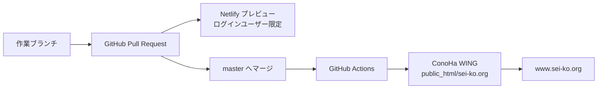

# sei-ko.org（デジタル担当室）

公開サイト: <https://www.sei-ko.org/>

このリポジトリは、デジタル担当室サイトの**唯一のソース**です。通常の更新は GitHub の
`master` を経由し、ConoHa WING の本番サイトへ自動反映されます。

## まず読む場所

| やりたいこと | 読む場所 |
| --- | --- |
| サイト本文・見た目を更新する | この README の「通常の更新」 |
| 本番配信・秘密情報・障害対応 | [運用手順](docs/operations/deployment-and-recovery.md) |
| デザイン刷新の履歴・制約 | [design-refresh の案内](docs/design-refresh/README.md) と [進捗](docs/design-refresh/PROGRESS.md) |
| お問い合わせ内容をGoogle Sheetsへ控える設定 | [tools/README.md](tools/README.md) |
| GitHub Copilotにこのリポジトリを保守させる | [Codex Sei-ko Maintainer](.github/agents/sei-ko-maintainer.agent.md) を選ぶ |

## 構成

| 場所 | 役割 |
| --- | --- |
| `index.html` / `guide.html` / `pricing.html` / `privacy.html` / `404.html` | 公開ページ |
| `styles.css` / `script.js` | 共通の見た目・動作 |
| `assets/` | 公開画像 |
| `contact.php` | ConoHa上で動くお問い合わせ受付（PHP） |
| `.htaccess` | HTTPS・www統一、CSP、キャッシュなどのApache設定 |
| `.github/workflows/conoha-production.yml` | `master` からConoHaへ安全に同期する設定 |
| `.github/scripts/deploy_conoha.py` | 差分比較・安全なFTP更新処理 |
| `docs/` | 作業・運用の文書。公開サーバーへは送らない |
| `tools/` | Google Sheets連携の管理用資料・スクリプト。公開サーバーへは送らない |

## 配信の全体像



- **Netlify** は確認用です。PHPの`contact.php`は実行しません。
- **ConoHa** が本番です。DNS・独自ドメイン・メール・Google Sheets連携はNetlifyへ移しません。
- GitHub Actions は、ConoHa上の既存ファイルを削除しません。内容が異なる公開対象だけを一時ファイルへ転送し、完全性を確認してから切り替えます。

## 通常の更新

1. `master` を最新化し、作業ブランチで変更する。
2. ローカルで確認する。

   ```powershell
   python -m http.server 8777
   ```

3. Pull Requestを作り、Netlifyプレビューで静的ページを確認する。
4. レビュー後に `master` へマージする。
5. GitHub Actions の **ConoHa production deploy** が成功したことを確認する。
6. 本番 `https://www.sei-ko.org/` を確認する。

`master` 以外のpushではConoHa本番へ配信されません。

## 変更時の重要な約束

- `contact.php` と `tools/` はメール送信・Google Sheets連携の本番系です。必要性を確認せず変更しないでください。
- CSPを緩めないでください。インラインの`style`・`script`、外部CDN、Webフォントの追加は不可です。
- CSS/JS/画像を変えた場合は、キャッシュバスターを更新し、参照している全ページを同期してください。
- `docs/`、`.github/`、`.netlify/`、IDE設定は本番へ配信されません。
- FTPクライアントやコマンドで通常更新を直接上書きしないでください。通常の本番反映はGitHub Actionsだけを使います。

詳細な配信、秘密情報更新、ドライラン、障害時の操作は
[運用手順](docs/operations/deployment-and-recovery.md)を参照してください。
